<picture>
  <source media="(prefers-color-scheme: dark)" srcset="assets/banner-dark.svg">
  
</picture>

<div align="center">

**Systems engineer. I model systems before they're built.**

[Email](mailto:YOUR-EMAIL@example.com) · [LinkedIn](https://www.linkedin.com/in/YOUR-LINKEDIN/) · [Portfolio](https://a1phex.github.io/janmesh-portfolio/) · [CV (PDF)](https://a1phex.github.io/janmesh-portfolio/cv-janmesh-thakare.pdf)

</div>

## Why hire me

*Your requirements, traced to evidence — the way I'd document any system.*

| | Requirement | Evidence |
|:--|:--|:--|
| `REQ-001` | MBSE applied in real automotive development | Modeled BMW's DASS airbag suppression system end-to-end in SysML — Master's thesis in series development, **grade 1.3** |
| `REQ-002` | Productive in industry tooling from day one | MagicDraw / Cameo daily across **two BMW engagements** · IBM DOORS NG |
| `REQ-003` | Bridges models and physical reality | B.E. Mechanical → M.Sc. Mechatronics · COMSOL + MATLAB simulation · Python, C++ |

## Projects

- **DASS Airbag Suppression — SysML model** · BMW Group. Requirements → use cases → structure → behavior, in BMW's live toolchain. *Proprietary detail discussed on request.*
- **[SHM Vibration Simulation](https://a1phex.github.io/janmesh-portfolio/)** · Damage detection via modal analysis. COMSOL, MATLAB.
- **[Pick-and-Place Robot](https://a1phex.github.io/janmesh-portfolio/)** · Mechanics, actuation and control as one integrated problem.

## Toolchain

`SysML` `MagicDraw/Cameo` `DOORS NG` `Requirements Engineering` `MATLAB/Simulink` `COMSOL` `Python` `C++`

## Path

```text
NOW ──────► Open to Systems Engineering / MBSE roles · Munich
    ├── BMW Group · Master's thesis — SysML model, DASS airbag suppression (1.3)
    ├── BMW Group · Systems engineering internship
    ├── Universität Siegen · M.Sc. Mechatronics
    └── SPPU Pune · B.E. Mechanical Engineering
```

---

<div align="center">

**If your system needs someone who models it before building it — [let's talk](mailto:YOUR-EMAIL@example.com?subject=Systems%20Engineering%20Opportunity).**

</div>
